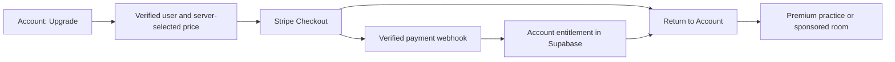

# Sign-in, access and subscriptions review

Reviewed 8 October 2026 against production and the current source. This is an assessment and implementation plan; no authentication UI or payment flow was changed. The requested additional account was provisioned and granted the existing full-library/AI permission in production. Email ownership remains unconfirmed until its first sign-in. No invitation or sign-in email was sent, and the account's email is deliberately omitted here.

## Recommended direction

Keep Supabase and a single combined sign-up/sign-in flow. Make email-code verification the primary phone flow, make ordinary paid access belong to the account, and introduce one full-access subscription with monthly/yearly billing. A paying host should be able to run a premium room with free signed-in participants. Keep AI as an explicitly enabled beta until its commercial allowance and cost model are defined.

Do account access and sign-in improvements before enabling checkout. The current code unlocks are adequate for informal distribution, but do not provide a secure, revocable subscription entitlement.

## What works now

- Email authentication is enabled; new accounts are allowed; automatic email confirmation is off. Email is the only enabled sign-in provider exposed by the public Auth settings.
- `signInWithOtp` creates an account when necessary, so a separate registration form is unnecessary. Sessions persist and refresh through the SDK. [Supabase passwordless sign-in](https://supabase.com/docs/guides/auth/auth-email-passwordless)
- Room invitations survive the email redirect through a validated room code. Arbitrary queries, auth fragments and caller-provided redirect URLs are not copied.
- AI access is read from the server through the user's RLS and checked independently on every hosted request. Browser access flags and editable user metadata cannot unlock paid AI calls.
- Both English and Norwegian account dialogs fit 320px and 390px phone widths in the checks performed.

## Sign-in improvements, in priority order

| Priority | Finding | Recommended change |
| --- | --- | --- |
| 1 | A simulated expired email callback returned to Home with no error; opening Account also showed none. | Recognize expected auth callback failures, remove their URL parameters, and open a clear recovery state with a request-new-code action. Avoid exposing raw provider errors. |
| 1 | Magic links can open a phone's email-app browser instead of the original browser/PWA. | Use an email code entered in the original app. This keeps the user's room or practice context. |
| 1 | The signed-out Account dialog puts a large access-code card above the email field. | Put sign-in first. Move license-code redemption into a small “Have an access code?” disclosure. |
| 1 | English “Send magic link” is jargon; new users are not told this also creates their account. | Use “Continue with email” / “Fortsett med e-post”, with one concise explanation of the combined flow. |
| 2 | A successful send leaves the same form on screen, with its status below Tour/About. There is no client resend cooldown. | Show a focused verification step immediately after sending, with resend cooldown and change-email controls. Keep errors close to the relevant field. |
| 2 | SDK errors can be displayed as raw English messages, even in Norwegian. | Map expired/invalid codes, rate limits, delivery failures and connection failures to short localized recovery messages. |
| 2 | “Sign out” uses the SDK default global scope. | Default to signing out this device; consider a separate explicit action for all devices if needed. [Supabase sign-out scopes](https://supabase.com/docs/reference/javascript/auth-signout) |
| 2 | The license-code field uses `autocomplete="one-time-code"`. | Reserve that autofill hint for the authentication code, so phone code suggestions reach the correct field. |
| Later | Only email is enabled. | Google/Microsoft sign-in may help frequent professional users, but postpone additional buttons until the email flow is reliable. Passwords and password-reset UI would add work without solving the current phone issues. |

Suggested minimal screens:

1. **Sign in**: email, Continue, and a compact access-code disclosure.
2. **Check your email**: destination email, one code field with numeric keyboard/paste/autofill, Verify, resend timer, and Change email.
3. **Account**: display name, library/plan status, subscription management when applicable, and sign out.

Supabase supports email OTP verification; the email template must include the token. A code-only template also avoids a documented problem where email security scanners consume one-use magic links. Keeping an automatically consuming link in the same email can undermine that benefit. [Passwordless methods](https://supabase.com/docs/guides/auth/auth-email-passwordless), [email prefetching and templates](https://supabase.com/docs/guides/auth/auth-email-templates)

Preserve the existing room invitation handling. Extend return intent only with a small validated set, such as room/progress/upgrade, rather than accepting arbitrary redirect URLs. Preserve the draft and paused practice when sign-in is requested.

The connector did not expose SMTP credentials/configuration, live email templates or the configured OTP limits. These remain checks, not confirmed faults. Verify the sender/domain, external-recipient delivery, code template, expiry and resend limits before rollout. Supabase's default mail service is restricted and intended for non-production use; custom SMTP is the production path. [SMTP guidance](https://supabase.com/docs/guides/auth/auth-smtp)

## Access changes needed before charging

Current library access and account access are different systems:

- A redeemed library code stores `pro`/`all` and an expiry in `dp_access_level` on that browser. It does not attach the purchase to an authenticated user or refresh from the account on a new device.
- AI uses `ai_admin_access`; this permission also makes `hasProAccess()` true. The newly requested account receives full library access through that existing path.
- Focused practice locks are frontend checks. Exercise JSON is downloaded without an entitlement-bearing request, and a downloaded skill bank contains all its cases. Mastery has no equivalent subscription check.
- The repository is public and contains the curriculum source and generated exercise banks. A frontend lock cannot make already-published material exclusive.

Add an account capability response separating full-content access, AI eligibility and administrative privileges. Store manual grants and subscription-derived access server-side, with ownership-based read policies and trusted server-only writes. Browser caching should support display/resume, not grant authority. Validate current access on protected operations and clear account-specific state on account changes.

If the commercial promise is protected premium content, move premium bank delivery behind authenticated access checks and keep future premium source/review packets out of public distribution. Previously published content cannot be made secret retroactively. A hosted-service subscription can instead sell the convenience of managed rooms, progress and supported hosting; that is a business-model decision to make explicitly.

Existing manual grants should continue to work independently of billing. Redeemed codes can eventually attach to the account under defined redemption rules. Paying for AI must not confer an administrator role.

## Subscription product

Start with one **Full access** plan, selectable monthly or yearly, and the current free sample practice. Do not change the existing free library merely to fit a pricing page without reviewing that product decision.

For the main group workflow, my recommendation is host sponsorship:

- The subscriber gets their own full library and can host premium rounds.
- Free signed-in participants can join that room, rotate roles and receive their own progress ratings.
- Room membership grants access only to that room's selected material. It does not unlock the participant's independent premium practice.
- Check the sponsor's entitlement when configuring/starting a round. Define how an existing round finishes if the subscription expires; avoid interrupting an item mid-practice.

This fits the app's emphasis on group practice and reduces the chance that a whole group stalls at checkout. Clinic/course seat bundles are a useful later offer. Shared-device practice should keep its current low-friction behavior; a subscribing host can open the material before handing over the device.

Keep AI under the existing approved beta access initially. A future AI add-on or allowance needs measured usage costs, visible remaining allowance and independent authorization. Current provider-request caps are safeguards, not a sellable “AI sessions” quota or a dollar budget. Do not promise unlimited AI from those caps.

## Payment provider options

| Provider | Fit for this project | Published base fees checked on 8 October 2026 |
| --- | --- | --- |
| Stripe Checkout + Billing | My default for a Norwegian pilot. Hosted checkout and a customer portal reduce custom payment UI; Edge Functions can connect payments to Supabase users. | Norwegian/EEA cards: 2.4% + NOK 2; pay-as-you-go Billing: 0.7% of billing volume. Currency conversion and other products can add fees. [Norway pricing](https://stripe.com/en-no/pricing) |
| Paddle | Worth considering if international direct sales are a priority and transaction-tax administration is a significant burden. It acts as merchant of record and includes subscription/payment services and sales-tax handling. | Standard checkout pricing: 5% + US$0.50 per transaction; approval and business fit still need checking. [Paddle pricing](https://www.paddle.com/pricing), [SaaS integration](https://developer.paddle.com/get-started/how-paddle-works/saas/) |

Subscription prices have not been chosen; set them after the access model and a small paid pilot are defined.

### Proposed Stripe flow

The existing static frontend can remain on GitHub Pages. Use the Supabase backend for authenticated checkout/customer-portal creation, current access and verified billing events.

Create checkout for the verified user's customer record with server-approved price IDs. Update access from verified, idempotent subscription/payment events rather than the success redirect. Handle renewal, payment failure, cancellation, refunds/disputes and out-of-order events according to an explicit access policy. The customer portal can handle payment-method updates, invoices and cancellation. [Checkout sessions](https://docs.stripe.com/api/checkout/sessions), [subscription events](https://docs.stripe.com/billing/subscriptions/webhooks), [customer portal](https://docs.stripe.com/customer-management)

Keep Upgrade/Manage subscription in Account and at meaningful locked-content entry points. Avoid adding subscription banners or controls during an active exercise. Prefer provider-hosted checkout initially; embedded checkout can be considered later if it improves a tested phone flow.

## Implementation sequence and acceptance checks

1. Fix callback recovery and put sign-in before access-code redemption. Check invalid/expired links, both languages, phone layouts, offline requests and preserved room intent.
2. Add email-code entry and update the live mail template together. Test real delivery to representative email clients, code paste/autofill, wrong/expired codes, resend cooldown and sign-in on the original phone/PWA. Keep browser tests isolated; do not consume someone else's link.
3. Add account entitlements and settle the premium distribution policy. Verify cross-device access, expiry/revocation, account switching and denial of forged browser flags.
4. Implement one monthly/yearly subscription in the provider's test environment. Verify checkout ownership, duplicate/out-of-order webhooks, payment failures, cancellation through the paid period and portal access.
5. Verify host-sponsored premium rooms with free participants, role rotation and host departure/expiry. Test independent premium access stays restricted for guests.
6. Choose prices, provider account/sender/domain details and customer-facing billing/support information, then activate live payments after reviewing the complete test flow.

## Work completed for this review

- Inspected frontend authentication, redirects, account UI, content loading/locks, AI authorization and current entitlement schema.
- Checked current Supabase Auth settings and relevant official documentation/changelog. No reviewed changelog breaking change required a code change for this assessment/grant.
- Provisioned the requested account through the Auth Admin API with email confirmation left pending; granted its existing full-content/AI access; verified the grant through the owner's RLS context without signing in as that person or calling OpenAI.
- Confirmed no confirmation or invitation request had been made for that account.
- Reviewed four phone dialogs (English/Norwegian at 320/390px), with simulated email sends. No horizontal overflow was found. The sent message was visible at those dimensions; its placement after Tour/About is still unnecessarily distant from the form.
- Reproduced the missing recovery state with a simulated expired auth callback. No real email was sent by the browser checks.
- Reviewed security advisors: existing service-only RLS/legacy function notices and password-protection notice remain; no schema or RLS change was introduced.
- No payment account, product, subscription, charge, live email-template change or frontend deployment was created as part of this review.
